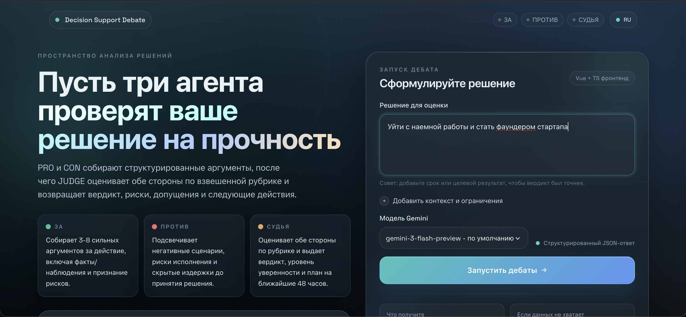
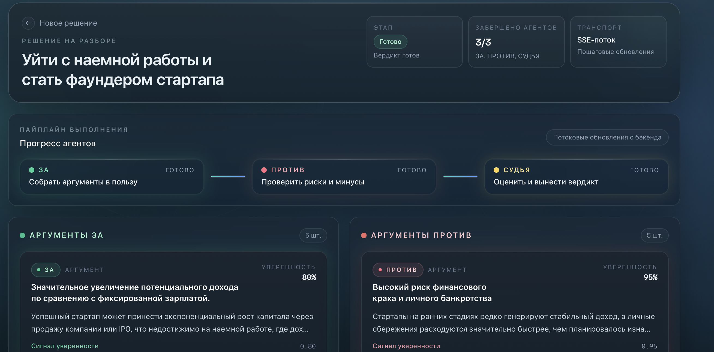
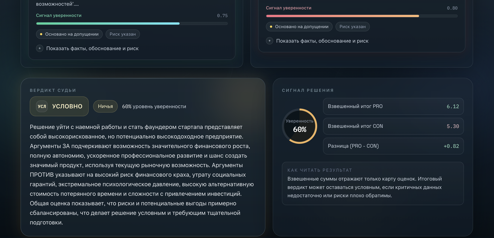
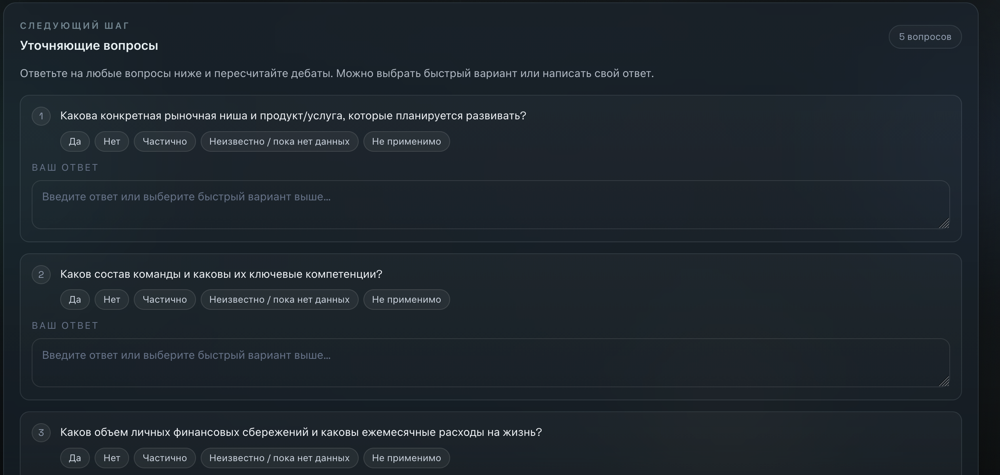

# Decision Support Debate

Интерактивный pet-project для оценки решений через дебаты трех агентов:
`ЗА` / `ПРОТИВ` / `СУДЬЯ`.

Проект помогает быстро проверить идею на прочность: собрать аргументы с обеих сторон, получить структурированный вердикт с оценкой по рубрике, ключевыми рисками, допущениями для проверки и планом действий на ближайшие 48 часов.

## Что внутри

- `Gemini API` через `google-genai` (`from google import genai`)
- `LangGraph` (без LangChain)
- `Pydantic v2` (строгие JSON-схемы)
- `Typer + Rich` для CLI
- `Vue 3 + TypeScript` для UI
- `SSE`-стриминг прогресса агентов в реальном времени
- `Docker Compose` для запуска фронта и бэка одной командой

## Возможности

- Дебаты в потоке: `ЗА -> ПРОТИВ -> СУДЬЯ`
- Structured output (валидируется через Pydantic)
- Вердикт: `go / no_go / conditional_go`
- Scorecard по рубрике с весами
- Уточняющие вопросы (`needs_more_info = true`)
- Повторный пересчет через UI после ответов на уточняющие вопросы
- Современный UI (RU-only)

## Скриншоты

### Экран запуска



### Поток выполнения и аргументы



### Scorecard и сравнение по рубрике



### Уточняющие вопросы и следующий шаг



## Быстрый старт (Docker Compose)

### 1. Подготовить переменные окружения

```bash
cp .env.example .env
```

Заполните `GEMINI_API_KEY` в `./.env`.

### 2. Запустить всё одной командой

```bash
docker compose up --build
```

### 3. Открыть приложение

- Frontend UI: `http://localhost:5173`
- Backend OpenAPI: `http://localhost:8000/openapi.json`

Остановить:

```bash
docker compose down
```

## Локальный запуск (без Docker)

### Backend (FastAPI + SSE)

```bash
python3 -m venv .venv
source .venv/bin/activate

pip install -e .
pip install fastapi "uvicorn[standard]" sse-starlette

set -a
source .env
set +a

uvicorn agent_debate.api:app --host 0.0.0.0 --port 8000
```

### Frontend (Vue + TS)

```bash
cd frontend
nvm use 20 || (nvm install 20 && nvm use 20)
npm install
npm run dev -- --host 0.0.0.0
```

## CLI usage

```bash
# Базовый запуск
agent-debate debate "Нанять второго backend-инженера" \
  --context "Стартап, runway 6 месяцев, высокая продуктовая нагрузка"

# Сохранить полный JSON
agent-debate debate "Уйти с работы и запустить стартап" \
  --context "Подушка 12 месяцев, MVP за 6 недель" \
  --model "gemini-3-flash-preview" \
  --save-json out.json
```

## Пример сценария в UI

1. Формулируете решение и контекст
2. PRO/CON генерируют аргументы (стримингом)
3. JUDGE выдает вердикт и scorecard
4. Если данных не хватает, отвечаете на уточняющие вопросы
5. UI автоматически пересчитывает дебаты с учетом новых ответов

## Архитектура проекта

```text
decision-debate/
  .env.example
  .gitignore
  .dockerignore
  docker-compose.yml                # frontend + backend одним запуском
  pyproject.toml                    # python package config + CLI entrypoint
  README.md
  agent_debate/
    __init__.py
    cli.py                          # Typer + Rich CLI
    api.py                          # FastAPI + SSE API for frontend
    graph.py                        # LangGraph pipeline (START -> pro -> con -> judge -> END)
    llm.py                          # Gemini wrapper + retries + fallback + schema sanitization
    prompts.py                      # PRO / CON / JUDGE system prompts
    schemas.py                      # Pydantic schemas (Argument, DebatePosition, Verdict)
  frontend/
    src/
      components/                   # DebateForm / DebateView / VerdictPanel / cards / status bar
      composables/useDebate.ts      # SSE stream parsing + UI state
      i18n.ts                       # RU localization layer
      types/                        # DTOs for frontend state
    vite.config.ts
  infra/
    docker/
      backend/
        Dockerfile                  # FastAPI backend image
      frontend/
        Dockerfile                  # Vue build + Nginx static server
        nginx.conf                  # SPA serving + /debate proxy (SSE-friendly)
  docs/
    screenshots/                    # Скриншоты для README
```

## Технологический стек

- Python 3.11+
- Google Gemini (`google-genai`)
- LangGraph
- Pydantic v2
- Typer + Rich
- FastAPI + Uvicorn + `sse-starlette`
- Vue 3 + TypeScript + Vite
- TailwindCSS
- Docker / Docker Compose

## Примечания

- UI сейчас intentionally `RU-only`.
- Для работы нужен только один секрет: `GEMINI_API_KEY`.
- Если Gemini перегружен (`503`), в backend есть ретраи и fallback по моделям.
